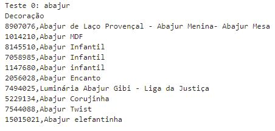
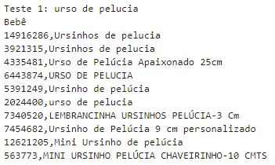
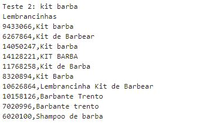
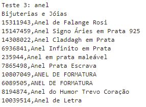
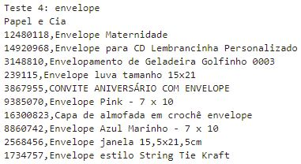

# Case Elo7

### Menu

1. [Instalação e Intruções](#installation)
2. [Motivação do Projeto](#motivation)
3. [Descrição dos Arquivos](#files)
4. [Resultados](#results)
5. [Licença, Autores, Reconhecimentos](#licensing)

## Instalação e Intruções 

Todas as bibliotecas python adicionais para rodar esse projeto estão em em *requirements.txt*. O código foi gerado no python 3.8.12

1. Para instalar todas as dependências, rode no comand line: 
          `pip install -r requirements.txt`

2. Rode os seguintes comandos na raiz do projeto para executar os modelos: 

    - Para rodar o modelo de classificação:
        `python teste_ds.py --category "{'feature_1':<input_da_feature_1>,'feature_2':<input_da_feature_2>,...}"`

    Exemplo:
        `python teste_ds.py --category "{'title': 'Mandala Espírito Santo','concatenated_tags': 'mandala mdf', 'price': 171.89,'weight': 1200,'express_delivery':1, 'minimum_quantity': 4}"`

    - Para rodar o modelo de recomendação:
        `teste_ds.py --recommendation "<título do produto>"`

    Exemplo: 
        `teste_ds.py --recommendation "abajur"`

## Motivação do Projeto

Esse projeto faz parte da etapa teórica do processo seletivo para a vaga no time Data Science do Elo7. Como desafio foi criado dois modelos de machine learning, o primeiro é um classificador produtos que dado as características do produto como entrada classifica-o entre  Bebê, Bijuterias e Jóias, Decoração, Lembrancinhas, Papel e Cia e Outros. E o segundo modelo apenas recebe o título de um produto, e precisa classificá-lo, e recomendar 10 produtos com base naquele inicial.

Todos os dados foram fornecidos pela [Elo7](https://elo7-datasets.s3.amazonaws.com/data_scientist_position/elo7_recruitment_dataset.csv). É necessário fazer o download do dataset para a pasta /data.

## Descrição dos Arquivos

1. A descrição de arquivos desse projeto:

<pre>
<code>
.
|-- data
|   |-- .gitkeep
|-- imgs
|   |-- classifier_result.JPG
|   |-- recommender_result_1.JPG
|   |-- recommender_result_2.JPG
|   |-- recommender_result_3.JPG
|   |-- recommender_result_4.JPG
|   |-- recommender_result_5.JPG
|-- models
|   |-- classifier.pkl  # modelo de classificação salvo
|   |-- recommender.pkl  # modelo de recomendação salvo
|-- notebooks
|   |-- analise_exploratoria.ipynb  # EDA do dataset
|   |-- classificador.ipynb  # modelagem do classificador
|   |-- sistema_de_recomendacao.ipynb  # modelagem do sistema de recomendação
|-- utils
|   |-- utils 
|   |   |-- __init__.py # package init
|   |   |-- estimators.py # módulo contendo custom sklearn estimators
|   |   |-- utils.py # módulo contendo funções auxiliares
|   |   |-- metrics.py # módulo contendo métricas
|   |-- setup.py # package setup
|-- LICENSE 
|-- README.md
|-- requirements.txt # dependências
|-- teste_ds.py # arquivo main
</code>
</pre>

## Resultados 

1. Classificador:

Para o conjunto de teste a média não ponderada do F1-Score excluindo a categoria 'outros' foi de 0.8156. 

2. Testes do sistema de recomendação:

3.1. Features usadas para treinar o classificador:
- TF-IDF do título e das tags concatenadas depois do processamento de texto
- Preço
- Peso
- Entrega expressa
- Quantidade mínima

3.2. Features usadas para treinar o sistema híbrido de recomendação:
- TF-IDF do título depois do processamento de texto

4. Desafios de modelagem:

Para o classificador, por esse problema ser bastante desbalanceado entre as classes, esperava-se que isso atrapalharia a performance, porém não foi uma questão tão grande. O que acabou impactando um pouco o modelo foi a falta de informação para diferenciar a categoria 'Papel e Cia' das demais. Além disso, a parte mais trabalhosa foi criar o pipeline das features textuais, porém foram elas que deram bastante resultado como mostrado na abordagem 1, já é possível ter um bom resultado só com essas features.

Para o sistema de recomendação híbrido, a estratégia de classificação apesar de ser simples é bem funcional. Porém recomendar produtos com uma maior variedade se mostrou uma tarefa difícil, visto que é necessário ao mesmo tempo manter uma relação da recomendação com o produto de entrada.

## Licença, Autores, Reconhecimentos 

Todos os direitos dos dados pertencem a Elo7. De outra forma, utilize o código como desejar. 
